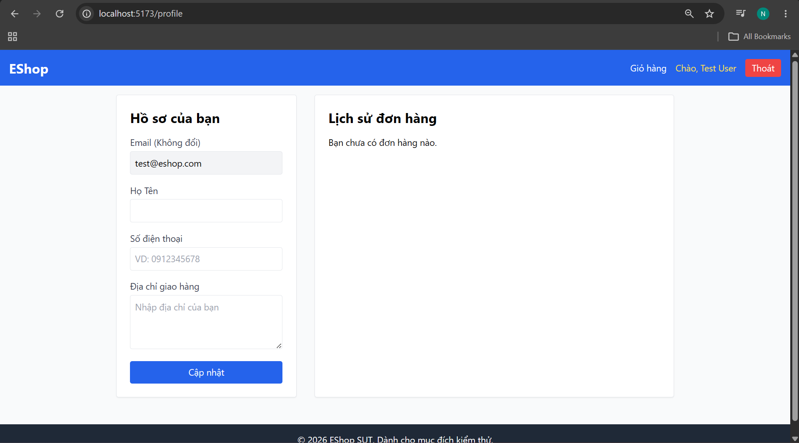

# Bug #2: Missing Required Field Indicators

## Description
Required form fields are not clearly marked to show users which fields must be filled in.

## Observation
Looking at the Profile form, two fields are required but have no visual indicator:
- "Họ Tên" (Name) - Required but no asterisk
- "Số điện thoại" (Phone) - Required but no asterisk
- "Địa chỉ giao hàng" (Address) - Optional, correctly unmarked

## Screenshot

## Expected Behavior
Required fields should be clearly marked with asterisk (*) or other visual indicator, such as:
- ✅ "Họ Tên *" 
- ✅ "Số điện thoại *"
- ✅ "Địa chỉ giao hàng" (no mark, optional)

## Actual Behavior
All labels appear without any marking, making it unclear which fields are mandatory.

## User Impact
- 😕 Users may not know which fields are required
- 😕 Form submission may fail if optional-looking fields are left empty
- ♿ Accessibility: Visual users don't get hints (HTML validation exists but users can't see it)

## Test Evidence
When attempting to submit form with empty required fields, browser shows standard HTML5 validation, but there's no visual pre-warning in the form labels.

## Severity
🟡 MEDIUM

---

**Test Case**: TC-31  
**Date Found**: 2026-07-02  
**Environment**: http://localhost:5173/profile
