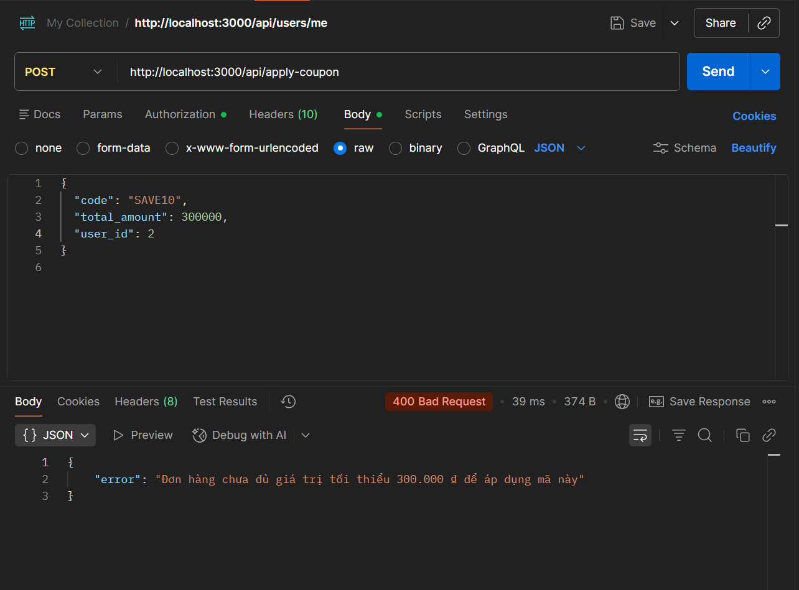

# Functional Bug: Incorrect Boundary Logic for Minimum Order Amount

## Description

The coupon application API (`POST /api/apply-coupon`) incorrectly uses the `>` (greater than) operator instead of `>=` (greater than or equal to) when checking if the order's total amount meets the coupon's minimum required amount. This causes coupons to be rejected when the order amount exactly matches the threshold.

## Steps to Reproduce

1. Ensure the coupon `SAVE10` is active with `min_order_amount = 300000`.
2. Make a `POST /api/apply-coupon` request with `total_amount` exactly equal to `300000`:

```json
{
  "code": "SAVE10",
  "total_amount": 300000,
  "user_id": 1
}
```

3. Observe the response.

## Expected Result

The coupon should be applied successfully (HTTP 200) since the condition "minimum 300,000" is met.

## Actual Result

The API rejects the request and returns HTTP 400 with the error: `"Đơn hàng chưa đủ giá trị tối thiểu 300.000 ₫ để áp dụng mã này"`.

## Severity

🔴 **HIGH**
It directly blocks users from using valid coupons when their cart value perfectly matches the threshold, leading to bad UX.

## Screenshot



---

**Test Case**: TC-02 (Ranh giới chạm ngưỡng - min)  
**Date Found**: 2026-07-04  
**Environment**: Localhost (Backend API)  
**Method**: API Testing (BVA)  
**Status**: CONFIRMED BUG
