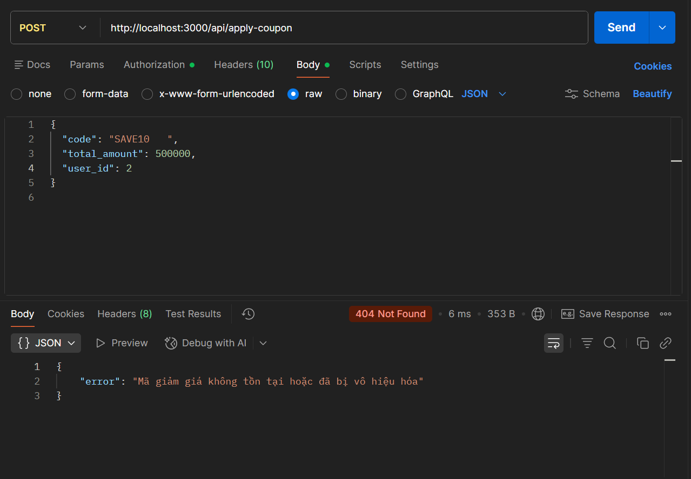

# UX / Functional Bug: Code Format Mishandling (Case & Whitespace)

## Description

The coupon application API does not sanitize the input string before querying the database. It is highly sensitive to case formatting (e.g., `save10` vs `SAVE10`) and leading/trailing whitespaces.

## Steps to Reproduce

1. In the system, there is an active coupon code `SAVE10`.
2. Make a request to `POST /api/apply-coupon` with `code` containing trailing whitespaces (e.g., `"SAVE10   "`) or lowercase letters (e.g., `"save10"`).

## Expected Result

The system should automatically trim whitespaces and convert the input to uppercase (or perform a case-insensitive query) to ensure a seamless mobile user experience (Mobile keyboards often add auto-spaces).

## Actual Result

The API returns `HTTP 404` with the message: `"Mã giảm giá không tồn tại hoặc đã bị vô hiệu hóa"`.

## Severity

🟠 **MEDIUM**
While not a security risk, it creates significant friction for mobile users (UX), leading to frustration when auto-correct or auto-space modifies their input.

## Screenshot

---

**Test Case**: TC-12 (White-space trim), TC-13 (Case Sensitivity)  
**Date Found**: 2026-07-04  
**Environment**: Localhost (Backend API)  
**Method**: API Testing (Mobile UX Handling)  
**Status**: CONFIRMED BUG
