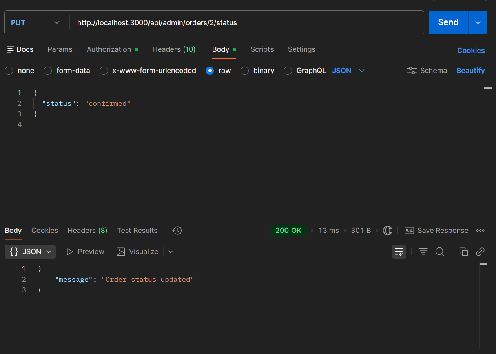
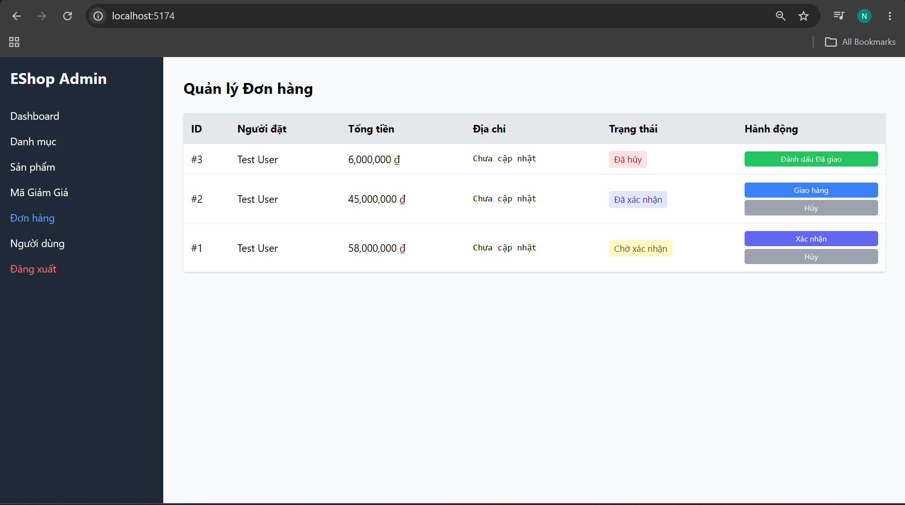

# Critical Security Issue: Privilege Escalation on Admin Order API

## Description
A regular user can update the status of any order using the Admin API endpoint, effectively bypassing role-based access control.

## Steps to Reproduce
1. Login as a regular user (e.g., test@eshop.com) and obtain the JWT token.
2. Identify any `orderId` (e.g., 1).
3. Make a PUT request to the Admin Order Status API:
```javascript
fetch('/api/admin/orders/1/status', {
  method: 'PUT',
  headers: {
    'Content-Type': 'application/json',
    'Authorization': 'Bearer ' + token
  },
  body: JSON.stringify({ status: "confirmed" })
})
```
4. Observe the response.

## Expected Result
System should reject the request with `HTTP 403 Forbidden` because the user lacks the 'admin' role.

## Actual Result
✅ Request succeeds with `HTTP 200 OK`.
❌ The order status is updated successfully despite the caller being a regular user.

## Security Impact
🚨 **CRITICAL**
Any regular user can tamper with the order fulfillment process, approve or cancel orders inappropriately.

## Root Cause
The `PUT /api/admin/orders/:id/status` endpoint lacks proper authorization middleware to check if the user is an admin.

## Severity
🔴 **CRITICAL - MUST FIX BEFORE DEPLOYMENT**

## Screenshot



---

**Test Case**: TC-18  
**Date Found**: 2026-07-04  
**Environment**: Localhost (Backend API)  
**Method**: API Testing (Blackbox)  
**Status**: CONFIRMED VULNERABLE
