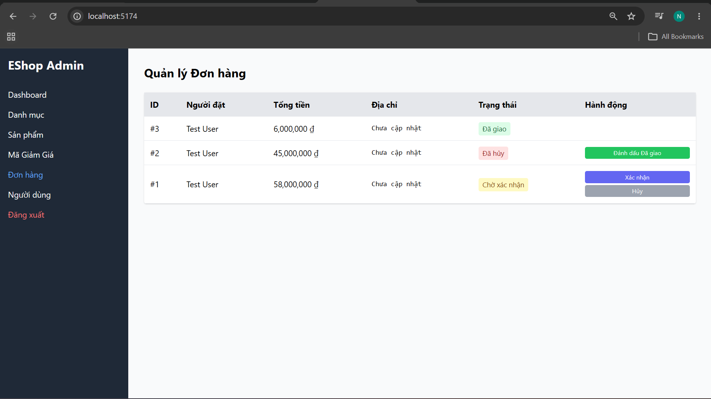
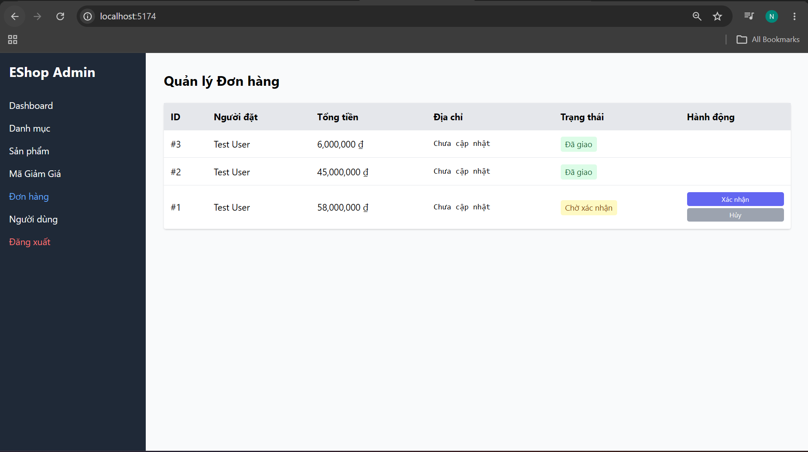

# Functional Bug: Admin Can Mark Canceled Orders as Delivered

## Description
The Admin Order Management UI allows an administrator to transition an order from the `Đã hủy` (Canceled) status directly to the `Đã giao` (Delivered) status. The backend accepts this invalid state transition without throwing any validation error.

## Steps to Reproduce
1. Log in to the Admin Dashboard (e.g., admin@eshop.com / Admin123!).
2. Navigate to the Orders management page (`Đơn hàng`).
3. Locate any order with the status `Đã hủy` (Canceled).
4. Notice that the action button `Đánh dấu Đã giao` (Mark Delivered) is visible next to the canceled order.
5. Click `Đánh dấu Đã giao`.

## Expected Result
- Canceled orders should be in a final state and must not have any transition actions available in the UI.
- The button `Đánh dấu Đã giao` must not be visible on `Đã hủy` orders.
- The backend API should reject any attempt to update the state of a Canceled order to Delivered, returning a `400 Bad Request`.

## Actual Result
- UI: Canceled orders display the action button `Đánh dấu Đã giao`. Clicking it transitions the order status to `Đã giao` successfully.
- API: The backend allows the transition and updates the DB.

## Severity
🟠 **MEDIUM**

## Screenshot

---

**Test Case**: Edge case (Derived from TC-06 to TC-10 group)  
**Date Found**: 2026-07-04  
**Environment**: Localhost (Frontend Admin & Backend API)  
**Method**: UI Testing & API Testing  
**Status**: CONFIRMED BUG
