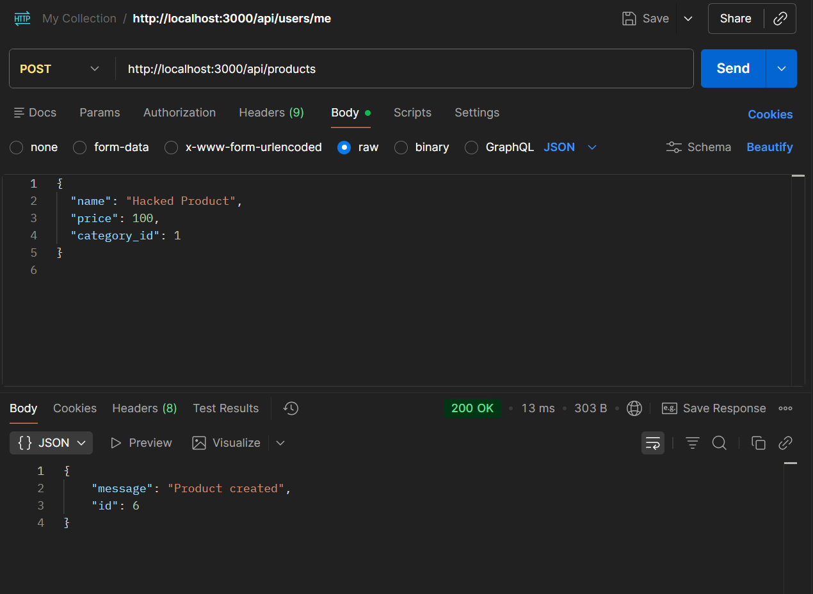

# Critical Security Issue: Unauthenticated & Unauthorized Product Management

## Description

The Product CRUD endpoints (`POST /api/products`, `PUT /api/products/:id`, `DELETE /api/products/:id`) lack any authentication and authorization middleware. As a result, any user (including unauthenticated guests) can create, modify, or delete products in the system.

## Steps to Reproduce

1. Without logging in (no JWT token), open an API client (or browser console).
2. Make a `POST` request to create a product:

```javascript
fetch("http://localhost:3000/api/products", {
  method: "POST",
  headers: { "Content-Type": "application/json" },
  body: JSON.stringify({
    name: "Hacked Product",
    price: 100,
    category_id: 1,
  }),
});
```

3. Observe the response returns `HTTP 200 OK` (which is also incorrect for creation, should be 201) and successfully creates the product.
4. Try `DELETE /api/products/:id` without a token and observe it also succeeds.

## Expected Result

- System should reject requests without a token with `HTTP 401 Unauthorized`.
- System should reject requests from regular users with `HTTP 403 Forbidden`.

## Actual Result

✅ All requests succeed regardless of authentication status.
❌ The database is modified successfully by guests.

## Security Impact

🚨 **CRITICAL**
Complete lack of access control allows malicious actors to deface the store, delete all products, or inject fraudulent products.

## Root Cause

The server does not include the `authenticateToken` middleware for product modification routes.

## Severity

🔴 **CRITICAL - MUST FIX BEFORE DEPLOYMENT**

## Screenshot



---

**Test Case**: TC-18, TC-19, TC-20  
**Date Found**: 2026-07-04  
**Environment**: Localhost (Backend API)  
**Method**: API Testing (Blackbox)  
**Status**: CONFIRMED VULNERABLE
