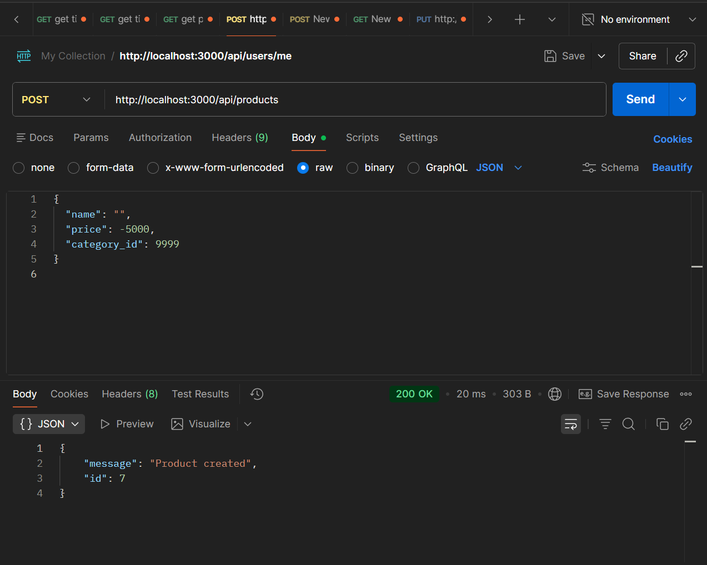

# Functional Bug: Missing Data Validation in Product API

## Description
The backend API for creating and updating products (`POST /api/products`, `PUT /api/products/:id`) does not perform any data validation. It accepts invalid data such as empty product names, negative prices, zero prices, excessively long names, and non-existent category IDs.

## Steps to Reproduce
1. Make a `POST` request to `http://localhost:3000/api/products` with the following invalid payload:
```javascript
{
  "name": "", // Empty name (TC-03)
  "price": -5000, // Negative price (TC-08)
  "category_id": 9999 // Non-existent category (TC-12)
}
```
2. Observe the response and check the database.

## Expected Result
The backend should perform boundary and constraint checks and return `HTTP 400 Bad Request` with an appropriate validation error message.

## Actual Result
✅ The backend accepts the request and returns `HTTP 200 OK`.
❌ Invalid products (empty name, negative price) are written directly into the database.

## Severity
🔴 **HIGH**

## Screenshot


---

**Test Case**: TC-03, TC-04, TC-07, TC-08, TC-09, TC-12  
**Date Found**: 2026-07-04  
**Environment**: Localhost (Backend API)  
**Method**: API Testing (BVA)  
**Status**: CONFIRMED BUG
